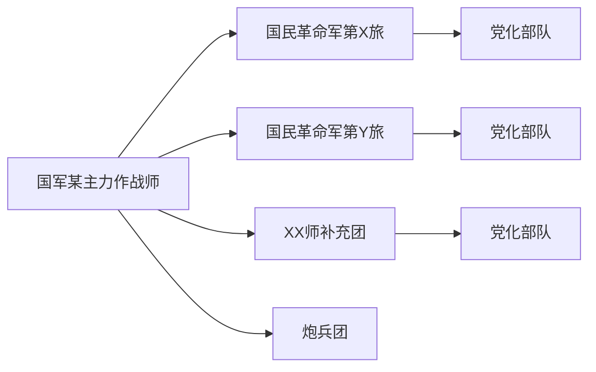
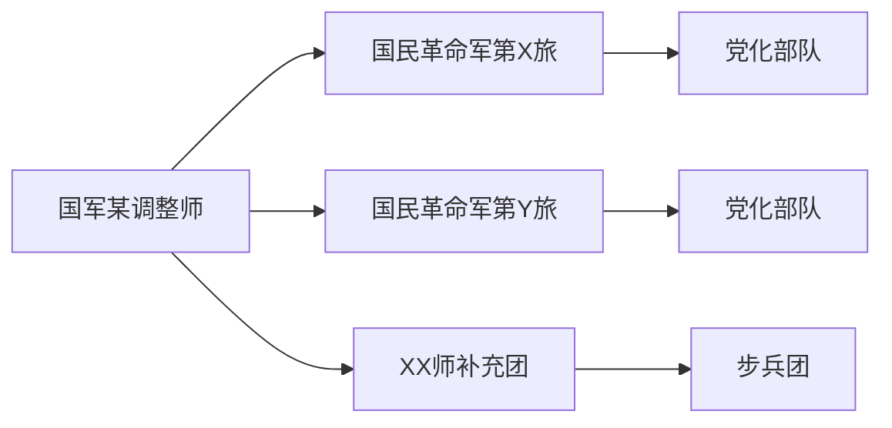
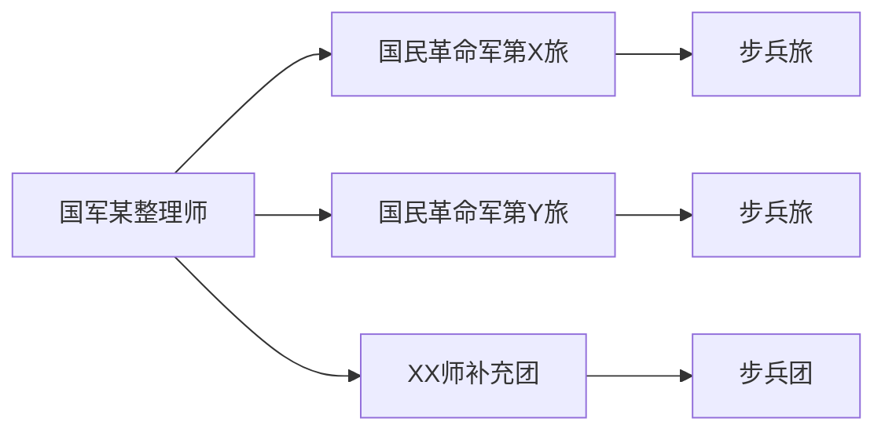

# HOI3 国军mod修正与战力强化部署记录
笔者在爽完这个HOI3 mod的1936国军开局时，至1939年遭新四军事件反复弹窗BUG掣肘，爽玩节奏深受其扰，遂下决心亲自部署,亲自指挥修正该BUG。

 tm的我找了半天(也是笔者菜的缘故),，最终锁定问题根源：events/CCW.txt文件内，本应按序列编列700000、700001、700002三号事件，然原作者误将700001号事件错编为700002号，导致双700002号事件冲突，触发时序一到即陷入循环弹窗，严重干扰我爽的进程。将事件编号修正后，BUG彻底消除。

BUG修正后，结合自身游戏水平，为强化国军战力、优化笔者的游戏体验，笔者进一步下决心，对mod内容作出以下部署：
1.  调整**指挥部**属性，增设指挥部**空投**适配功能，确保伞兵部队可直接配属指挥部伞降后，无需落地再增，提升空地协同作战代入感；
2.  重构国军精锐“党化部队”战力参数：机动速度提升至7km/h，火力强度小幅跃升，防御强度强化至7点，部队坚韧度上调至65（PS：这个坚韧度是个啥?_?）；
3.  为国军序列增设无补给依赖型游击队单位，完善敌后作战体系；
4.  补全**青年军**、**荣誉师**成军相关事件，两支部队触发代码分别为556（青年军）、555（荣誉师）；
5.  给国军的编制也改了一下（笔者懒得开局一个个整编），将多数基本作战单位整编成“两旅一补充团”三步兵编制体系，具体架构如下：

**4个德械师**

**几个主力军序列师**

**中央军旁系**

HE

6.  为20个德械师配属1936年编制下真实将领（当前部分将领数据缺失，后续将逐步补全编制）。
